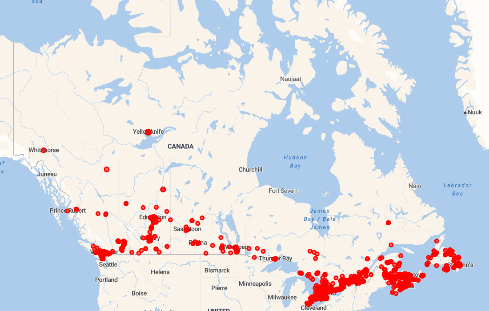

# Canada Map Requests

Code to generate a map of [DonateMask.ca](https://donatemask.ca) requests across Canada.

## Info

Use `npm start` to generate the map.  The `ATLAS_URI` environment variable must be defined so that the database can be accessed.

The map is automatically updated using GitHub Actions and a cron job.
